# OpenDot

**An AI assistant that runs on your own computer, takes requests in Slack or
your terminal, and uses the AI subscription you already pay for.**

<p align="center">
  
</p>
<p align="center"><sub>The grey lines show what happens on your machine. Slack shows only the
request and the answer.</sub></p>

You ask for something in plain words. OpenDot does the work in a locked-down
container on your machine. The model in the container cannot post, push or call
a connector itself. It proposes those actions, and OpenDot carries them out at
once. OpenDot does not ask you to approve them.

> [!IMPORTANT]
> OpenDot runs AI agents that have a shell and internet access. Read
> [SECURITY.md](SECURITY.md) before you give it real work.

## What you can ask it

| Ask it to... | What happens |
| --- | --- |
| **Answer a question**<br>"Summarise what changed in RFC 9110 section 9" | It reads, researches, and replies in the same thread. |
| **Fix code and open a pull request**<br>"Add retries to the upload client in acme/api" | It edits a copy of the repository in its container. OpenDot runs your tests, pushes a new branch, and opens the pull request. It never pushes to your main branch. |
| **Use a web browser**<br>"Check the pricing page of example.com" | A Chrome browser inside the container opens pages, clicks, and takes screenshots. |
| **Use your other tools**<br>"Find last week's notes about the launch" | It calls the MCP servers you connect. You decide which servers, and which of their tools it can use. |
| **Look up economic and market data**<br>"How fast have US consumer prices risen since 2019?" | The [FactIQ](https://github.com/defog-ai/factiq-plugin) connector is built in. |
| **Do something on a schedule**<br>"Every weekday at 9am, tell me if that page changed" | It saves the schedule, and can post only when the result changes. |
| **Wait and come back**<br>"Check again in an hour whether the release is out" | The task sleeps and wakes up later to continue. |
| **Remember how you like things**<br>"Always give me numbers in a table" | It keeps short notes about each person it works for. You can read, change, and delete them. |

## Use the subscription you already have

OpenDot does not call an AI model itself. It runs a coding tool that you have
already logged in to, such as Claude Code, Codex or opencode. If you pay for a
plan, the work counts against that plan. You do not need a separate API
account.

| If you pay for | OpenDot runs | Log in once with |
| --- | --- | --- |
| Claude Pro or Max | Claude Code | `opendot login claude` |
| ChatGPT Plus, Pro, Business or Enterprise | Codex | `codex login` |
| OpenRouter, an opencode plan, or another provider that opencode supports | opencode | `opencode auth login` |
| Nous Portal, or another provider that Hermes supports | Hermes Agent | not supported yet |

Check your provider's terms for automated use of your plan.

## Pick your model

One model does the work. The default is Codex. You choose it when you set up:

```sh
# The default: Codex
opendot init

# Only a Claude subscription: Claude Code
opendot init --worker claude_code

# Any model on OpenRouter, through opencode
opendot init --worker opencode --worker-model openrouter/~deepseek/deepseek-pro-latest
```

To change the model later, edit the `[backend.worker]` section of your config
file (`~/.config/opendot/opendot.toml`):

```toml
[backend.worker]
kind = "claude_code"   # claude_code, codex or opencode
model = "opus"         # empty means the tool's own default
```

| Tool | What to write in `model` | Examples |
| --- | --- | --- |
| `claude_code` | A name that `claude --model` accepts | `opus`, `sonnet`, `haiku` |
| `codex` | A model name that Codex accepts | `gpt-5.5`, `gpt-5.4-mini` |
| `opencode` | `provider/model`, as `opencode models` lists it. Required. | `openrouter/~anthropic/claude-sonnet-latest`, `opencode-go/deepseek-v4-flash` |

The free `opencode/...` models work only inside opencode's own app. Pick a
model from a provider that you logged in to with `opencode auth login`.

## Set it up for real

You need:

- Linux or macOS.
- Python 3.11 or newer, and [uv](https://docs.astral.sh/uv/).
- Docker.
- A login for at least one tool from the table above.

**1. Install OpenDot.**

```sh
uv tool install git+https://github.com/defog-ai/opendot
```

**2. Write a config file.** Choose your model here (see
[Pick your model](#pick-your-model)).

```sh
opendot init
```

This writes `~/.config/opendot/opendot.toml` and makes a private folder for
OpenDot's data.

**3. Build the container image.** This takes a few minutes the first time.

```sh
opendot build-image
```

**4. Log in to your AI tool** on this computer. Run the line for the tool
that you chose:

```sh
codex login
opencode auth login
opendot login claude
```

`opendot login claude` runs `claude setup-token`, which opens a browser page
where you sign in. It then asks you to paste the token that was printed, and
saves it in `~/.config/opendot/claude-token`. Only you can read that file.
Every `opendot` command reads it, including the runs that cron starts, so you
do not add anything to your shell profile.

**5. Check everything.**

```sh
opendot doctor
```

Each line starts with `[ok]`, `[warn]` or `[error]`. Fix every `[error]` line;
the line tells you how. See [When something goes wrong](#when-something-goes-wrong).

**6. Give it a first task.**

```sh
opendot task "Summarise the three main points of RFC 9110 section 9"
opendot tick
opendot status
```

`opendot tick` does one round of work. To have OpenDot work on its own, run
`opendot install-cron` once. It then does a round every minute.

Every setting and its default is in
[opendot.example.toml](opendot.example.toml).

### Talk to it in Slack

1. Create a Slack app from [slack-app-manifest.yml](slack-app-manifest.yml) and
   install it in your workspace.
2. Copy the bot token (it starts with `xoxb-`) and save it:
   `opendot login slack`. OpenDot keeps it in a file that only you can read,
   so the runs that cron starts find it too.
3. Invite the bot to the channels it should read.
4. Add this to your config file, with your own channel and user ids:

```toml
[channels.slack]
enabled = true
bot_token_env = "OPENDOT_SLACK_BOT_TOKEN"
channels = ["C0EXAMPLE1"]          # channels it reads
allowed_users = ["U0EXAMPLE1"]     # only these people can give it work
```

To find an id in Slack: open the channel or the person's profile, click the
name at the top, and copy the id at the bottom of the panel.

Then mention the bot in one of those channels: `@opendot what can you do?`

OpenDot checks Slack each time `tick` runs, so an answer comes on the next
round, not at once.

## Turn on pull requests, the browser and MCP tools

Each of these is off until you add one block to your config file. Run
`opendot doctor` after each change; it checks the new block.
[docs/features.md](docs/features.md) explains each one in full.

### Pull requests

Make a GitHub fine-grained token that can write the contents, pull requests
and issues of one repository. Save it with `opendot login github`. Then add:

```toml
[github]
token_env = "OPENDOT_GITHUB_TOKEN"   # a set variable wins over the saved token

[[repositories]]
name = "app"
remote = "https://github.com/example/app.git"
checks = ["uv run pytest -q"]        # must pass before OpenDot pushes
```

```sh
opendot github fetch
opendot task "In app, fix the typo in the README title and open a pull request"
opendot tick                  # OpenDot commits, runs the checks, pushes and opens the pull request
opendot github publications   # lists the branch and the pull request
```

The model only edits files. OpenDot makes the commit, runs your checks, and
pushes only when the checks pass. It pushes to a new branch, never to the main
branch.

For a git server that is not GitHub, set `forge = "none"` on the repository.
OpenDot can then push a branch, but not open a pull request. See
[docs/features.md](docs/features.md#pull-requests).

### A web browser

```toml
[browser]
enabled = true
```

```sh
opendot build-image           # rebuild once, so the image holds the browser
opendot browser check --url https://example.com
opendot task "Open https://example.com and tell me the page title"
```

The browser runs inside the step container. It starts with no cookies and no
saved logins. Screenshots are saved in the task's folder.

### MCP tools

Add one block for each MCP server. Mark each tool `read` or `write`:

```toml
[[mcp_servers]]
name = "docs"
url = "https://mcp.example.com/mcp"
auth = "bearer_env"                   # "none", "bearer_env" or "oauth"
auth_env = "DOCS_MCP_TOKEN"           # the variable that holds the key
tools = [
  { name = "search", mode = "read" },         # the model can call it
  { name = "create_note", mode = "write" },   # the model proposes it, OpenDot calls it
]
```

```sh
opendot connectors login docs  # asks for the key and saves it
opendot connectors test docs   # checks that the tools exist on the server
opendot connectors calls       # shows every call the model made
```

The key stays on your machine. The model reaches the server through a small
relay that OpenDot runs, and the relay adds the key.

### FactIQ

[FactIQ](https://factiq.com) gives OpenDot public economic and financial data.
It is built in:

```sh
opendot init --with-factiq    # or add [factiq] enabled = true to your config
opendot connectors login factiq   # asks for your FactIQ API key and saves it
opendot connectors test factiq
opendot task "How fast have US consumer prices risen since 2019?"
```

## What protects you

OpenDot runs every action that the model proposes. It does not ask you first,
and no second model checks the action. So choose carefully what you connect:
the repositories, the MCP tools marked `write`, and the Slack channels.

These protections stay in place:

- **The model has no keys.** A separate program on your machine, the OpenDot
  host, keeps the Slack token, the GitHub token and the connector keys. The
  model's container gets none of them. It gets only the login of its own AI
  tool. So the model can only propose an action; the host carries it out.
- **Only known actions run.** The host refuses an action of a kind it does not
  know. The host, not the model, builds each target: a pull request goes to a
  repository that you listed, and a Slack reply goes to the thread that the
  task came from.
- **Only listed people give work.** In Slack, OpenDot takes work only from the
  people in `allowed_users`.
- **Pushes are checked.** Your checks must pass before a push. The host never
  pushes to the main branch. Before a push to a public repository, it looks for
  private text in the change and stops if it finds any.
- **Each step runs in a new container.** The container has no extra Linux
  privileges, a read-only system disk, CPU and memory limits, and your user id
  instead of root.
- **You can stop a task.** `opendot stop N` stops it at once. A stopped task
  runs none of its remaining actions.
- **Everything is recorded.** `opendot show N` lists every action of a task and
  its result.

[docs/how-it-works.md](docs/how-it-works.md) explains each part.
[SECURITY.md](SECURITY.md) lists what OpenDot protects against and what it does
not.

## When something goes wrong

| You see | Do this |
| --- | --- |
| `Codex login file ... is missing` | Run `codex login`. |
| `no Claude Code login` | Run `opendot login claude`. |
| `... is not set and not saved`, or `... is set here but not saved` | Run the command that the message names, such as `opendot login slack`. |
| `opencode login file ... is missing`, or `has no login for ...` | Run `opencode auth login` and choose the provider in your model name. |
| `image ... is not built` | Run `opendot build-image`. |
| `state folder ... has mode 775; it must be 700` | Run `chmod 700` on that folder. |
| A step fails with `operation not permitted` | Your Docker is the snap package. See the note below. |
| Nothing happens after `opendot task` | Run `opendot tick`, or `opendot install-cron` once. |
| A task is stuck | `opendot show N` tells you why. `opendot retry N`, `opendot skip N` or `opendot stop N` moves it on. |

**Docker from the snap package** (Ubuntu's default) blocks one of OpenDot's
container protections. Either install Docker from docker.com, or add
`no_new_privileges = false` under `[sandbox]` in your config and accept that
weaker setting. Snap Docker also cannot see folders under `/tmp`, so keep
OpenDot's data folder out of `/tmp`. The default place, under your home folder,
works. `opendot doctor` tells you when either setting is wrong.

## Commands

| Command | What it does |
| --- | --- |
| `init`, `login claude`, `doctor` | Write a config file; save the Claude login; check logins, Docker, and the image. |
| `login slack`, `login github`, `connectors login NAME` | Save the Slack token, the GitHub token, or a connector's key, so that cron runs find them. |
| `build-image`, `verify-image` | Build and check the container image. |
| `task "..."` | Give it work from the terminal. |
| `tick`, `install-cron` | Do one round of work; do a round every minute from cron. |
| `status`, `queue`, `show N` | See tasks, unfinished tasks, or one task in full. |
| `retry N`, `skip N`, `stop N` | Run a task again, skip it, or stop it now. |
| `notes`, `schedules` | List and change notes and schedules. |
| `github repos`, `fetch`, `publications` | List your repositories, download them, and list what OpenDot pushed or opened. |
| `browser check` | Open a page with the browser in the container. |
| `connectors list`, `test`, `calls`, `login` | List MCP servers, check one, show the calls, or sign in to one. |

`opendot COMMAND --help` shows the options of each command. `opendot --help`
lists every command.

## Current limits

- It works on one task step at a time.
- It checks Slack about once a minute, so replies are not instant.
- OpenDot does not ask before it acts. Every proposed action runs.
- A follow-up from a different person in a finished thread starts a new task.
- The browser has no saved logins.
- No email yet.

The full list is in [docs/how-it-works.md](docs/how-it-works.md#known-limits).

## Development

```sh
git clone https://github.com/defog-ai/opendot && cd opendot
uv sync
uv run pytest -q
uv run ruff check .
```

`uv run python docs/make_demo_svg.py docs/demo.svg` redraws the animation.
See [CONTRIBUTING.md](CONTRIBUTING.md) and [CHANGELOG.md](CHANGELOG.md).

## License

Apache License 2.0. See [LICENSE](LICENSE) and [NOTICE](NOTICE).

OpenDot is an independent open-source project, inspired by the dots assistant
that OpenAI [announced](https://openai.com/index/introducing-dots/) on
2026-09-29. It is not affiliated with or endorsed by OpenAI, Anthropic, Nous
Research, or the opencode project.
